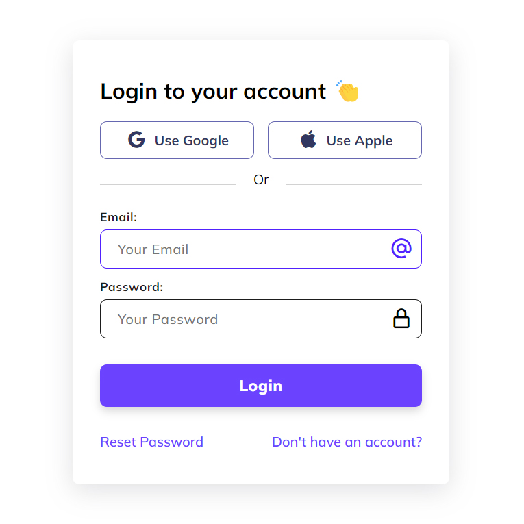

# Minimal Login Design
In this tutorial, I'll show you how to use HTML, CSS, and JavaScript to create a fully responsive login page. We'll use CSS Flexbox and media queries for our responsive design and CSS transitions for some cool animation effects. This Login design is responsive on all devices!

# Screenshot
Here we have project screenshot :

